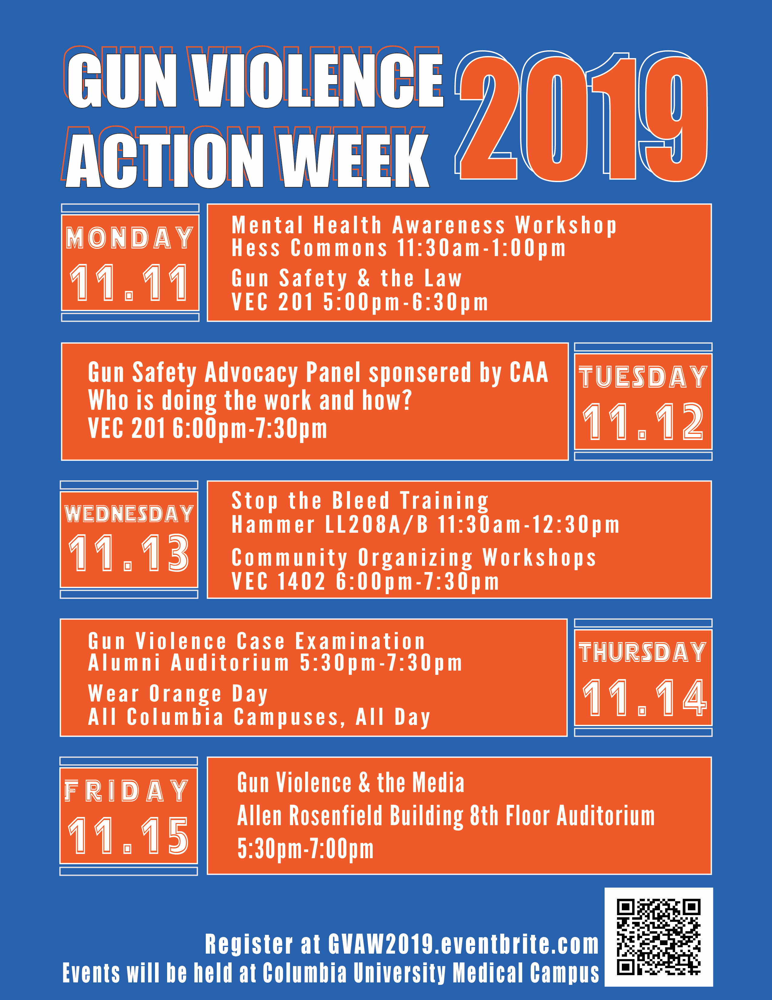

**Gun Violence Action Week 2019**

* Organized over 300 students, 4 community organizations, researchers, professors, and academic institutions to participate in a weeklong series of events with the aim of bringing awareness to and discussion around gun violence prevention through an interprofessional lens.
* Lead the Gun Violence Action Committee in creating and implementing 8 programs for the 5-day series of events covering topics related to violence prevention and healing including mental health, media, law, and community organizing.
* Organized the creation of flyers, social media posts, email blasts, and Eventbrite events.
* Fostered partnership between academia and community to provide a bridge between practice and action regarding violence prevention.
* Created, administered, and analyzed survey data of participants
* Partnered with 7 student organizations to fund the week of events.