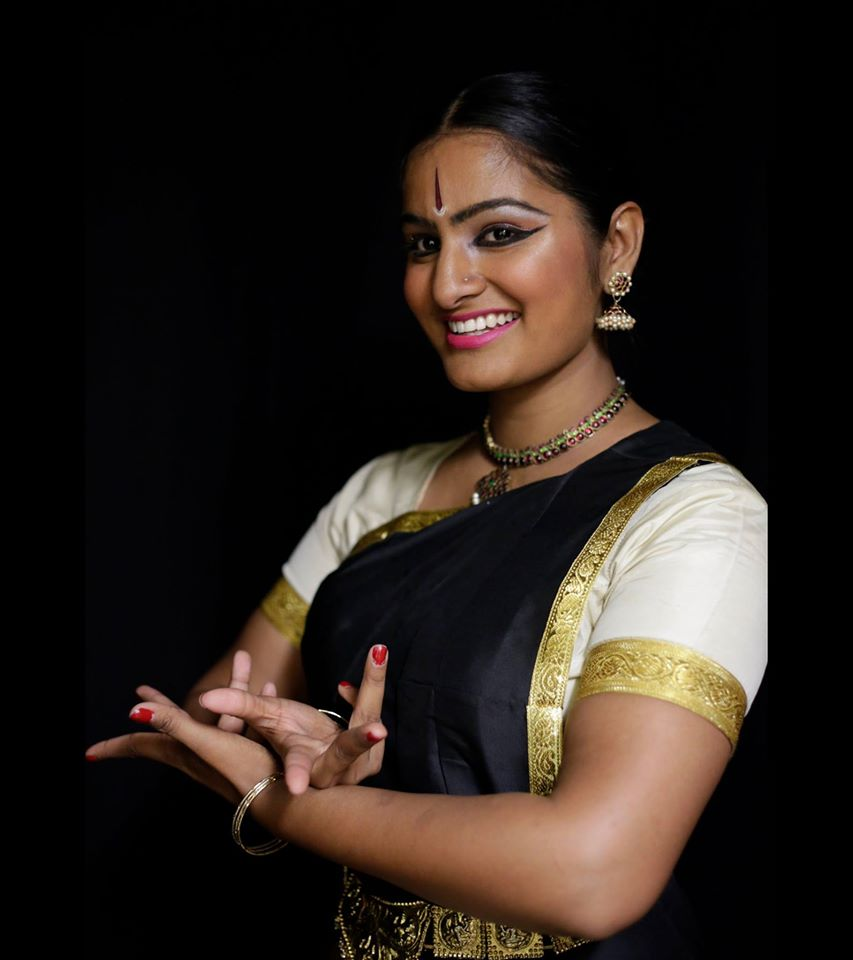

---
output:
  html_document:
    toc: true
    toc_float: true
---

# Professional Experience

---

Dance Haven | 2018-Present

**Dancer**

* Learn contemporary Bharatanatyam, Bollywood, and Bhangra mix
choreography
* Prepare for performances, by attending all rehearsals and meetings
* Perform in a large two night showcase at the end of our four month preparation

Nava Dance Theater | 2013-2018

**Company Dancer**

* Learned choreography that was Bharatanatyam with a contemporary twist for
multiple productions
* Attended all rehearsals and practiced choreography from videos
* Improvised choreography when necessary, as instructed by our director
* Attended adavu workshops for strength training outside of regular rehearsals
* Performed 30+ shows with live audiences entailing multiple iterations o f three
predictions

# Education and Professional Training

---

Kalanjali: Dances of India | 2001-Present

**Dance Student**

* Learned Kalakshetra style Bharatanatyam from K.P. and Katherine Kunhiraman.
* Performed in multiple lecture demonstrations led by Katherine Kunhiraman.
* Attended a three month intensive in Chennai, India with K.P. Yesodha.

# Previous Performance Highlights

---

* Drive East, Group Dance NYC, NY (2019)
* Margam Performance, Solo Guruvayor Temple, Kerala (2017)
* Counterpulse’s Performing Diaspora, Group Dance SF, CA (2015)
* Drive East, Group Dance NYC, NY (2015)
* Ethnic Dance Festival, Two Group Dances SF , CA (2013)
* Traditions Engaged: An International Festival of Classical Indian Dance & Music, Group Dance SF , CA (2011)

